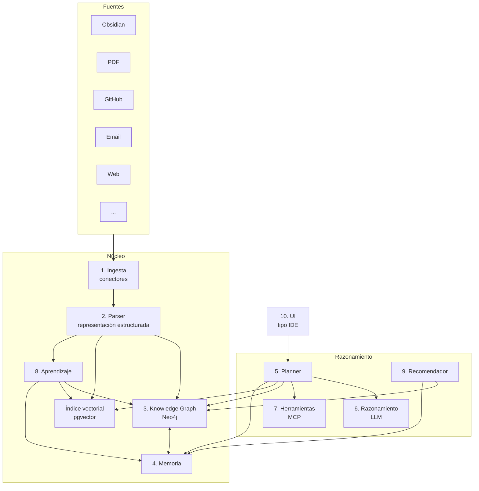
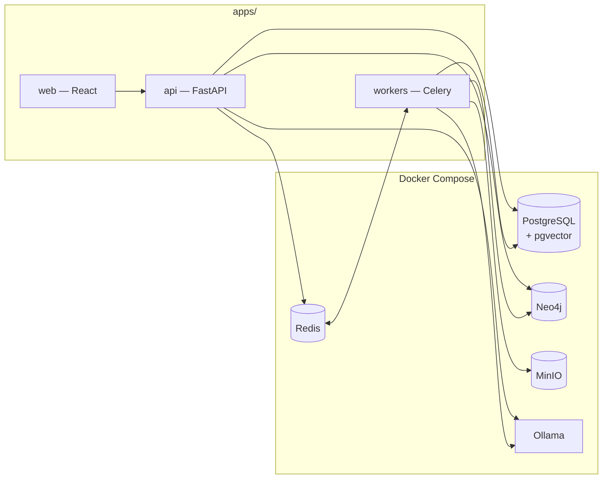

# 01 — Arquitectura general del sistema

**Estado:** 🟢 Aprobado (2026-07-13) · **Última actualización:** 2026-07-11

## 1. Vista de conjunto

KOS se organiza en **10 dominios**, cada uno con una responsabilidad única. Las flechas indican el flujo principal de datos y control:

**Regla central:** el LLM (dominio 6) nunca toca datos directamente. Todo acceso pasa por el planner (dominio 5), que decide qué buscar, dónde y cómo fusionar los resultados.

## 2. Los 10 dominios

### Dominio 1 — Ingesta

**Responsabilidad:** consumir cualquier fuente de conocimiento y convertirla al formato interno común (`RawDocument`).

- Cada fuente tiene un **conector** que implementa una interfaz única: `discover()`, `fetch()`, `watch()`.
- Los conectores no saben nada del grafo ni de embeddings: solo producen `RawDocument`.
- Conectores iniciales: Obsidian (markdown + wikilinks + frontmatter), PDF, repositorios Git. Después: JSON de ChatGPT/Claude, email, HTML/web, DOCX, CSV.
- Detalle completo en [05 — Ingesta y actualización](05-ingesta-y-actualizacion.md).

### Dominio 2 — Parser

**Responsabilidad:** transformar cada `RawDocument` en una representación estructurada (`ParsedDocument`).

Pipeline por documento: título → resumen → entidades → relaciones → metadata → chunking → embeddings → keywords → enlaces → autor → fecha → nivel de confianza. Todo automático.

- El parser es un pipeline de etapas componibles; cada etapa es independiente y testeable.
- La extracción de entidades/relaciones usa el LLM local con salida estructurada validada contra la ontología.
- Cada afirmación extraída lleva un **confidence score** y la referencia exacta a su origen (documento, chunk, offset).

### Dominio 3 — Knowledge Graph

**Responsabilidad:** el corazón del sistema. No guarda texto: guarda **entidades y relaciones**.

- Neo4j es la fuente de verdad de las relaciones ([ADR-0003](adr/0003-neo4j-como-fuente-de-verdad-del-grafo.md)).
- La ontología (tipos de nodos, relaciones y propiedades) está definida en [02 — Modelo de dominio](02-modelo-de-dominio-y-ontologia.md).
- Todo nodo y toda arista referencian su evidencia: qué documentos la sostienen y con qué confianza.

### Dominio 4 — Memoria

**Responsabilidad:** persistir lo que el sistema sabe más allá de los documentos.

Cinco tipos: episódica (conversaciones), semántica (conceptos consolidados), procedimental (cómo hacer cosas), temporal (lo último que ocurrió) y de preferencias (cómo trabaja el usuario). Detalle en [04 — Memoria y aprendizaje](04-memoria-y-aprendizaje.md).

### Dominio 5 — Planner

**Responsabilidad:** nunca responder directamente; primero planificar.

Ante cada consulta, el planner produce un **plan de ejecución** explícito: qué buscar en embeddings, qué consultar en el grafo, qué memoria recuperar, cómo fusionar y en qué orden. El plan es un objeto serializable, trazable y auditable. Detalle en [03 — Arquitectura de agentes](03-arquitectura-de-agentes.md).

### Dominio 6 — Razonamiento

**Responsabilidad:** aquí vive el LLM. Sintetiza, razona y redacta usando **solo** el contexto que el planner le entrega.

- Interfaz de LLM abstracta: Ollama por defecto ([ADR-0006](adr/0006-local-first-con-ollama.md)), APIs cloud opcionales por tarea.
- Sin acceso a red, disco ni bases de datos: el aislamiento es arquitectónico, no una convención.

### Dominio 7 — Herramientas

**Responsabilidad:** toda acción sobre el mundo exterior se expone como herramienta **MCP** ([ADR-0005](adr/0005-mcp-como-protocolo-de-herramientas.md)).

Ejemplos: leer PDF, leer/crear/modificar nota de Obsidian, crear carpeta, buscar en GitHub, buscar commits, crear roadmap, abrir navegador, buscar artículos. Las herramientas son la única vía por la que los agentes producen efectos secundarios.

### Dominio 8 — Aprendizaje

**Responsabilidad:** el sistema aprende, no solo responde.

Nueva nota → actualizar embeddings → actualizar grafo → actualizar memoria → actualizar roadmap → actualizar conocimiento. Todo automático, disparado por eventos de ingesta (ver [05](05-ingesta-y-actualizacion.md), sección de actualización incremental).

### Dominio 9 — Recomendador

**Responsabilidad:** generar valor sin que se le pregunte.

Deduce del grafo: lagunas de conocimiento ("sabes Docker, FastAPI, Linux, Git; te falta Kubernetes"), contradicciones entre notas, relaciones no vistas, reorganizaciones sugeridas. No porque alguien lo escribió — porque el grafo lo dedujo.

### Dominio 10 — UI

**Responsabilidad:** interfaz tipo **IDE**, no tipo ChatGPT.

- Panel izquierdo: explorador de conocimiento (fuentes, entidades, colecciones).
- Centro: conversación con planes de ejecución visibles.
- Derecha: grafo interactivo contextual a la conversación.
- Abajo: herramientas, trazas y logs de agentes.

## 3. Vista física (despliegue local)

| Responsabilidad | Almacén | Justificación |
|---|---|---|
| Documentos originales (blobs) | MinIO | Inmutables, versionables, baratos |
| Documentos parseados, chunks, embeddings | PostgreSQL + pgvector | Transaccional + búsqueda híbrida ([ADR-0002](adr/0002-postgres-pgvector-como-vector-db.md)) |
| Entidades y relaciones | Neo4j | Consultas de caminos y vecindarios ([ADR-0003](adr/0003-neo4j-como-fuente-de-verdad-del-grafo.md)) |
| Memoria | PostgreSQL (+ referencias al grafo) | Ver [04](04-memoria-y-aprendizaje.md) |
| Colas y cache | Redis + Celery | Ingesta y aprendizaje asíncronos |

## 4. Reglas de dependencia entre dominios

1. **Ingesta y Parser no conocen a nadie aguas abajo**: emiten eventos, no llaman servicios.
2. **El grafo no conoce las fuentes**: solo recibe entidades ya validadas contra la ontología.
3. **El LLM no conoce nada**: recibe contexto, devuelve texto/estructura.
4. **La UI solo habla con la API**: nunca con las bases de datos.
5. **Todo cruce de frontera usa los contratos** de [06 — APIs y contratos](06-apis-y-contratos.md).

Estas reglas son las que permiten añadir Notion, Gmail o Slack sin tocar el núcleo.

## 5. Decisiones registradas

Las decisiones estructurales de este documento están fijadas en ADRs: [0001](adr/0001-nucleo-independiente-de-fuentes.md) (núcleo independiente), [0002](adr/0002-postgres-pgvector-como-vector-db.md) (pgvector), [0003](adr/0003-neo4j-como-fuente-de-verdad-del-grafo.md) (Neo4j), [0004](adr/0004-monorepo.md) (monorepo), [0005](adr/0005-mcp-como-protocolo-de-herramientas.md) (MCP), [0006](adr/0006-local-first-con-ollama.md) (local-first).
