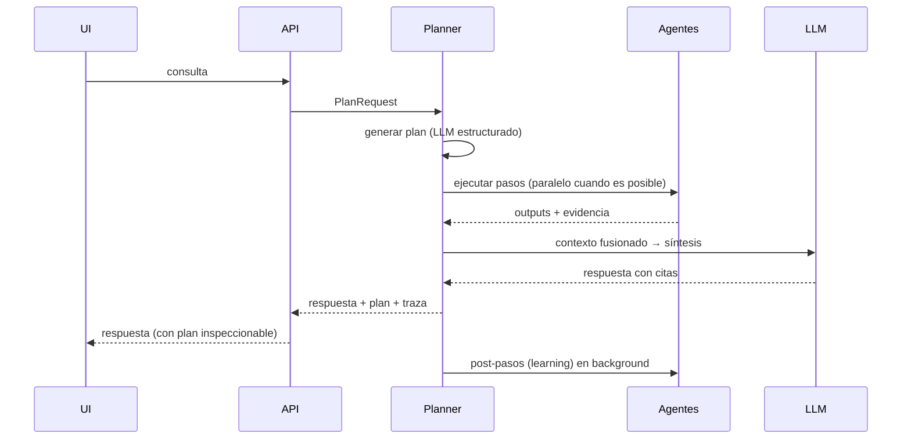

# 03 — Arquitectura de agentes y coordinación

**Estado:** 🟢 Aprobado, implementado · **Última actualización:** 2026-08-18 · **Habilita:** Fase 4

> **Implementado en v0.5** (Sprints 16–21, cerrado 2026-08-16): Planner real, `packages/agents`
> completo, servidor MCP real (`packages/mcp-tools`, 13 herramientas), planes auditables vía
> `GET /v1/plans/{id}`. Este doc sigue siendo la fuente de verdad del diseño — cambios al
> comportamiento real requieren PR sobre este doc primero, misma regla que cualquier doc 🟢.
> `RecommenderAgent` (v1.0, Sprint 22, ver [doc 11](11-recomendador-e-inteligencia-proactiva.md))
> reusa el mismo contrato `AgentRequest`/`AgentResponse` pero **no vive dentro de un `Plan`**: no
> lo elige el Planner ni aparece en `Plan.post` — lo dispara `apps/workers` directo ante
> `graph.updated` real (Celery encadenado, no pub/sub), fuera del ciclo de `/v1/query`.

## 1. Principio

**El sistema nunca responde directamente: primero planifica.** Cada consulta produce un plan de ejecución explícito, serializable y trazable. El LLM sintetiza al final, con el contexto que el plan reunió — nunca decide por sí mismo dónde buscar.

## 2. Los agentes

| Agente | Responsabilidad | Accede a |
|---|---|---|
| **Planner** | Descompone la consulta en un plan de pasos; decide qué agentes intervienen y cómo se fusionan los resultados | Catálogo de capacidades de los demás agentes |
| **Retrieval** | Búsqueda híbrida (texto + embeddings) sobre chunks | pgvector |
| **Graph** | Consultas de entidades, caminos y vecindarios | Neo4j (Cypher) |
| **Memory** | Recupera y escribe memoria episódica/semántica/preferencias | Almacén de memoria |
| **Research** | Busca fuera del sistema (web, GitHub, artículos) | Herramientas MCP externas |
| **Writing** | Redacta la respuesta final con citas; crea/modifica notas | LLM + herramientas MCP de escritura |
| **Learning** | Post-paso de `/v1/query`: registra cada interacción respondida en memoria episódica | `memory.store` (MCP, `confirm=true` forzado por código) |
| **Recommender** | Fuera del ciclo de consulta: ante `graph.updated` real, detecta lagunas de conocimiento y contradicciones | Grafo + `recommendations.store` (MCP) |

Cada agente expone un contrato uniforme (ver [06 — APIs y contratos](06-apis-y-contratos.md)):

```
AgentRequest  { task, inputs, constraints, trace_id }
AgentResponse { outputs, evidence[], confidence, cost, trace_id }
```

## 3. Anatomía de un plan

Pregunta: *"¿Qué debería aprender para crear agentes?"*

```yaml
plan_id: 7f3a…
query: "¿Qué debería aprender para crear agentes?"
steps:
  - id: s1
    agent: retrieval
    task: buscar chunks similares a "crear agentes IA"
  - id: s2
    agent: graph
    task: vecindario de Concept("agentes") + relaciones PREREQUISITE_OF
  - id: s3
    agent: graph
    task: skills actuales del usuario (KNOWS) para calcular la brecha
  - id: s4
    agent: memory
    task: conversaciones y roadmaps previos sobre agentes
  - id: s5
    agent: writing
    task: fusionar s1-s4 y redactar con citas
    depends_on: [s1, s2, s3, s4]
post:
  - agent: learning
    task: registrar interés en "agentes" en memoria de preferencias
```

Reglas:

1. Los pasos sin dependencias entre sí se ejecutan **en paralelo**.
2. Todo paso devuelve **evidencia** (doc_ids, node_ids, memory_ids); la respuesta final solo puede citar evidencia recogida.
3. El plan completo se persiste con su traza — es la unidad de depuración y de evaluación de calidad.
4. Presupuestos por plan (tiempo, tokens, pasos); si se exceden, el planner degrada a un plan más
   simple en lugar de fallar.

   > **Algoritmo concreto (Sprint 18, decidido 2026-08-15):** si la generación del plan falla o el
   > JSON no valida contra `Plan`/`PlanStep` (`kos_core.schemas.plan`) tras un reintento (con el
   > error de validación adjunto al prompt), el Planner cae al plan fijo retrieval→writing de
   > Sprint 17 — la misma ruta que ya existía antes de este sprint, ahora como red de seguridad en
   > vez de único camino. Se marca `Plan.degraded = true`: mismo campo y mismo significado que
   > `QueryResult.degraded` ya usaba desde Sprint 4 para la degradación léxica ("no pudo hacer lo
   > que hubiera preferido, pero respondió con lo que sí pudo"). Sprint 19 extiende esta misma
   > señal a los presupuestos de tiempo/pasos por ejecución (no solo a la generación del plan).

   > **Catálogo ampliado (Sprint 20, decidido 2026-08-16):** `research` se suma a
   > `retrieval`/`graph`/`writing` en el catálogo del Planner — el LLM lo elige cuando la pregunta
   > pide algo que el vault no puede tener (código/documentación de un proyecto externo, estado
   > actual de una librería). Vía las herramientas MCP `github.search_repos`,
   > `github.search_commits`, `web.search`, `web.open` (doc 06 §4) — todas de lectura, sin gate de
   > `permissions.py` nuevo. `memory` sigue fuera del catálogo (Sprint 21).

   > **Planificado — Sprint 21, "Aprender del plan" (decidido 2026-08-16, doc 08)**: `memory` se
   > suma al catálogo de evidencia del Planner, mismo patrón que `research` en Sprint 20 — el LLM
   > decide cuándo una pregunta se beneficia de memoria previa (`MemoryAgent.recall`, construido
   > standalone desde Sprint 17), en vez de una heurística casera. Y el `post:` de este mismo
   > ejemplo deja de ser solo un dibujo en el doc: el paso `learning` se dispara siempre
   > (determinístico, no elegido por el LLM — mismo comportamiento incondicional que
   > `kos.memory_learn` ya tiene desde Sprint 12, doc 04 §3 paso 1) al final de cada `/v1/query`
   > respondida, nunca bloqueando la respuesta al usuario (doc 04: "la UI nunca espera al
   > aprendizaje"). Se mantiene en Celery (no se vuelve una tarea en el proceso de la API): la
   > tarea `kos.memory_learn` pasa a construir un `LearningAgent` real y llamarlo vía un servidor
   > MCP embebido en el worker (mismo patrón que `apps/api` usa desde Sprint 17,
   > `kos_mcp.server.create_server`/`EmbeddedToolCaller`, uno nuevo por invocación de la tarea —
   > igual que el engine/driver ya se crean y cierran por tarea en `apps/workers`), en vez de
   > llamar `kos_core.memory_learn.learn_from_query_answer` directo. El `LearningAgent` pasa
   > `confirm=true` a `memory.store` por su cuenta: es el propio sistema completando un paso ya
   > decidido de antemano (aprender de cada interacción, doc 04 §3), no un agente/LLM decidiendo
   > escribir algo nuevo de forma autónoma — mismo espíritu que la excepción ya documentada para
   > `/crear-nota` en doc 06 §4. `Plan.post: list[PlanStep]` (nuevo campo, doc 03 §3) registra que
   > el paso se disparó, sin esperar su resultado (fire-and-forget, igual que hoy).
   >
   > Consumir el evento `graph.updated` (deuda desde Sprint 9, ver `docs/deuda-tecnica.md`) queda
   > **fuera de este sprint**: el objetivo es la ruta query→aprendizaje→recall, no la reacción a
   > cambios del grafo — se revisa en un sprint futuro sin bloquear este.

## 4. Coordinación mediante MCP

- Cada agente consume herramientas **solo** vía MCP ([ADR-0005](adr/0005-mcp-como-protocolo-de-herramientas.md)); los agentes no importan clientes de BD directamente — usan las herramientas registradas (`graph.query`, `vector.search`, `memory.recall`, `obsidian.write_note`…).
- El catálogo de herramientas es dinámico: registrar un nuevo servidor MCP amplía las capacidades del planner sin redesplegar.
- Permisos por herramienta: las de escritura (`*.write_*`, `*.create_*`) requieren confirmación del usuario hasta que este las marque como autónomas.

## 5. Ciclo de ejecución



## 6. Evolución por fases

| Fase | Estado de esta arquitectura |
|---|---|
| Fase 1 | Sin agentes: un pipeline fijo retrieval → síntesis (el "plan" es estático) |
| Fase 2 | Se añade el paso de grafo al pipeline fijo |
| Fase 4 | Planner real: planes dinámicos, agentes como procesos separados, trazas completas |
| Fase 5 | El Recomendador genera planes proactivos sin consulta del usuario |

> **Precisión (doc 11, planificado 2026-08-16):** el primer corte de Fase 5 (v1.0) no genera
> `Plan`/`PlanStep` vía el Planner — "planes proactivos" se lee como "acción proactiva". La
> generación de recomendaciones (gaps, contradicciones) es determinística: reglas y consultas de
> grafo, con un paso LLM opcional solo para redactar título/descripción — no un loop de
> planificación LLM completo. Ver [11 — Recomendador e inteligencia proactiva](11-recomendador-e-inteligencia-proactiva.md) §5.

Empezar con el pipeline fijo y extraer los agentes después evita construir orquestación antes de tener nada que orquestar — pero los **contratos** (`AgentRequest/Response`) se usan desde la Fase 1, de modo que la extracción sea un refactor, no una reescritura.
