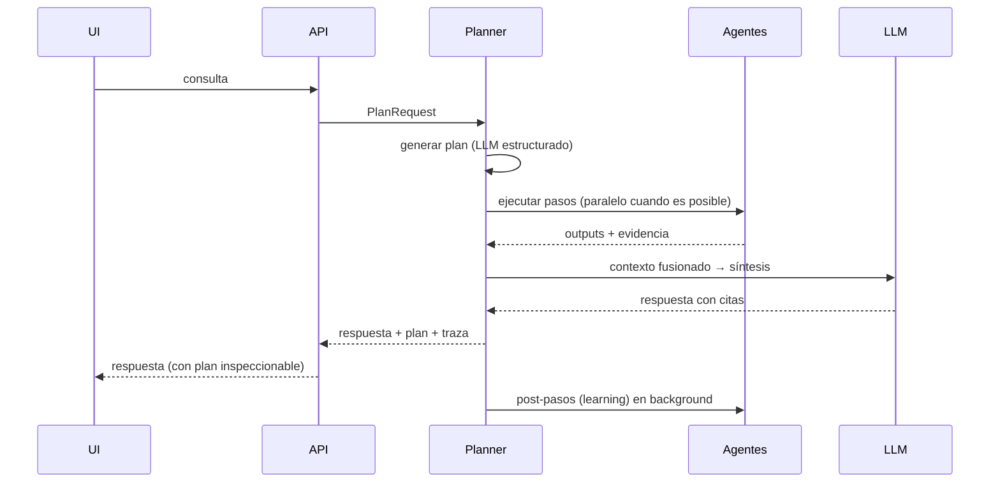

# 03 — Arquitectura de agentes y coordinación

**Estado:** 🟡 Borrador · **Última actualización:** 2026-07-11 · **Habilita:** Fase 4

## 1. Principio

**El sistema nunca responde directamente: primero planifica.** Cada consulta produce un plan de ejecución explícito, serializable y trazable. El LLM sintetiza al final, con el contexto que el plan reunió — nunca decide por sí mismo dónde buscar.

## 2. Los agentes

| Agente | Responsabilidad | Accede a |
|---|---|---|
| **Planner** | Descompone la consulta en un plan de pasos; decide qué agentes intervienen y cómo se fusionan los resultados | Catálogo de capacidades de los demás agentes |
| **Retrieval** | Búsqueda híbrida (texto + embeddings) sobre chunks | pgvector |
| **Graph** | Consultas de entidades, caminos y vecindarios | Neo4j (Cypher) |
| **Memory** | Recupera y escribe memoria episódica/semántica/preferencias | Almacén de memoria |
| **Research** | Busca fuera del sistema (web, GitHub, artículos) | Herramientas MCP externas |
| **Writing** | Redacta la respuesta final con citas; crea/modifica notas | LLM + herramientas MCP de escritura |
| **Learning** | Post-proceso: consolida lo aprendido en la interacción | Grafo + memoria (vía eventos) |

Cada agente expone un contrato uniforme (ver [06 — APIs y contratos](06-apis-y-contratos.md)):

```
AgentRequest  { task, inputs, constraints, trace_id }
AgentResponse { outputs, evidence[], confidence, cost, trace_id }
```

## 3. Anatomía de un plan

Pregunta: *"¿Qué debería aprender para crear agentes?"*

```yaml
plan_id: 7f3a…
query: "¿Qué debería aprender para crear agentes?"
steps:
  - id: s1
    agent: retrieval
    task: buscar chunks similares a "crear agentes IA"
  - id: s2
    agent: graph
    task: vecindario de Concept("agentes") + relaciones PREREQUISITE_OF
  - id: s3
    agent: graph
    task: skills actuales del usuario (KNOWS) para calcular la brecha
  - id: s4
    agent: memory
    task: conversaciones y roadmaps previos sobre agentes
  - id: s5
    agent: writing
    task: fusionar s1-s4 y redactar con citas
    depends_on: [s1, s2, s3, s4]
post:
  - agent: learning
    task: registrar interés en "agentes" en memoria de preferencias
```

Reglas:

1. Los pasos sin dependencias entre sí se ejecutan **en paralelo**.
2. Todo paso devuelve **evidencia** (doc_ids, node_ids, memory_ids); la respuesta final solo puede citar evidencia recogida.
3. El plan completo se persiste con su traza — es la unidad de depuración y de evaluación de calidad.
4. Presupuestos por plan (tiempo, tokens, pasos); si se exceden, el planner degrada a un plan más simple en lugar de fallar.

## 4. Coordinación mediante MCP

- Cada agente consume herramientas **solo** vía MCP ([ADR-0005](adr/0005-mcp-como-protocolo-de-herramientas.md)); los agentes no importan clientes de BD directamente — usan las herramientas registradas (`graph.query`, `vector.search`, `memory.recall`, `obsidian.write_note`…).
- El catálogo de herramientas es dinámico: registrar un nuevo servidor MCP amplía las capacidades del planner sin redesplegar.
- Permisos por herramienta: las de escritura (`*.write_*`, `*.create_*`) requieren confirmación del usuario hasta que este las marque como autónomas.

## 5. Ciclo de ejecución



## 6. Evolución por fases

| Fase | Estado de esta arquitectura |
|---|---|
| Fase 1 | Sin agentes: un pipeline fijo retrieval → síntesis (el "plan" es estático) |
| Fase 2 | Se añade el paso de grafo al pipeline fijo |
| Fase 4 | Planner real: planes dinámicos, agentes como procesos separados, trazas completas |
| Fase 5 | El Recomendador genera planes proactivos sin consulta del usuario |

Empezar con el pipeline fijo y extraer los agentes después evita construir orquestación antes de tener nada que orquestar — pero los **contratos** (`AgentRequest/Response`) se usan desde la Fase 1, de modo que la extracción sea un refactor, no una reescritura.
