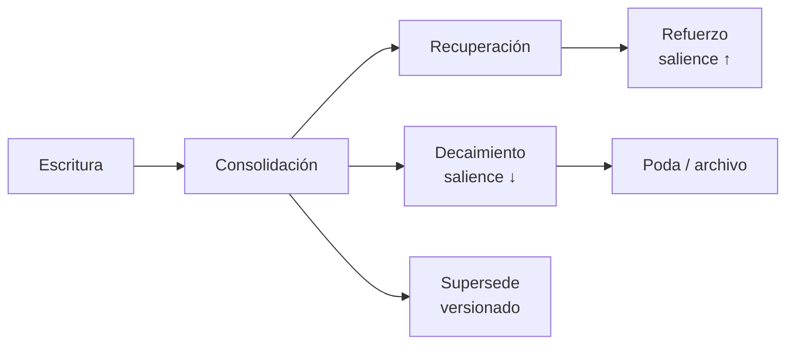

# 04 — Modelo de memoria y aprendizaje continuo

**Estado:** 🟡 Borrador · **Última actualización:** 2026-07-11 · **Habilita:** Fase 3

## 1. Principio

Los documentos son lo que el usuario escribió; la **memoria** es lo que el sistema sabe. La memoria persiste entre sesiones, se consolida con el tiempo y decae cuando pierde vigencia — igual que la humana, pero auditable.

## 2. Los cinco tipos de memoria

| Tipo | Contenido | Ejemplo | Escrita por |
|---|---|---|---|
| **Episódica** | Conversaciones e interacciones, con contexto | "El 3 de mayo pediste un roadmap de Kubernetes y descartaste Helm por ahora" | Learning Agent, tras cada sesión |
| **Semántica** | Conceptos consolidados, hechos destilados de múltiples fuentes | "El usuario despliega siempre en Railway" | Consolidación periódica |
| **Procedimental** | Cómo hacer cosas: procedimientos que funcionaron | "Para publicar el blog: build → rsync → purge CDN" | Learning Agent al detectar procedimientos |
| **Temporal** | Lo último que ocurrió; ventana deslizante | "Ayer se ingirieron 12 notas nuevas sobre LangGraph" | Pipeline de ingesta |
| **Preferencias** | Cómo trabaja el usuario | "Prefiere respuestas con código antes que teoría" | Learning Agent + declaraciones explícitas |

### Modelo de datos común

```
MemoryItem
├── memory_id
├── type              # episodic | semantic | procedural | temporal | preference
├── content           # texto destilado (no transcripciones completas)
├── embedding         # recuperación semántica de memorias
├── entities[]        # node_ids del grafo que menciona (enlace memoria ↔ grafo)
├── sources[]         # conversaciones/documentos de origen
├── confidence        # 0–1
├── salience          # importancia; decae con el tiempo, sube con cada uso
├── created_at / last_accessed_at
└── superseded_by     # versionado: una memoria nueva puede reemplazar otra
```

Almacenamiento: PostgreSQL (+pgvector para el embedding). Las memorias referencian nodos del grafo, nunca los duplican.

## 3. Ciclo de vida



1. **Escritura** — el Learning Agent destila cada interacción: qué se preguntó, qué se decidió, qué funcionó. Nunca se guardan transcripciones crudas como memoria.
2. **Consolidación** (job periódico) — agrupa memorias episódicas repetidas en semánticas ("3 veces preguntó por X" → "le interesa X"), detecta duplicados y contradicciones.
3. **Recuperación** — el Memory Agent busca por similitud + entidades del grafo + recencia, ponderado por `salience` y `confidence`.
4. **Decaimiento y poda** — `salience` decae exponencialmente; memorias temporales expiran solas; nada se borra sin pasar por estado archivado.
5. **Versionado** — una memoria que contradice otra más antigua la marca `superseded_by`; la historia queda auditable.

## 4. Aprendizaje continuo (dominio 8)

El aprendizaje es el pipeline que mantiene todo el sistema consistente ante cada cambio:

```
Evento (nueva nota / nota modificada / conversación terminada)
  ↓
Actualizar embeddings       (re-chunk + re-embed solo lo cambiado)
  ↓
Actualizar grafo            (nuevas entidades/relaciones; confianza ±)
  ↓
Actualizar memoria          (temporal siempre; episódica si hubo interacción)
  ↓
Actualizar roadmap          (si cambió el mapa de skills)
  ↓
Actualizar conocimiento     (recalcular lagunas, contradicciones, sugerencias)
```

Propiedades del pipeline:

- **Incremental**: solo se reprocesa lo afectado (ver [05 — Ingesta](05-ingesta-y-actualizacion.md), detección de cambios por hash).
- **Asíncrono**: corre en workers Celery; la UI nunca espera al aprendizaje.
- **Idempotente**: reprocesar el mismo evento dos veces no duplica nada.
- **Trazable**: cada actualización registra qué evento la causó.

## 5. Sistema de confianza

La confianza es transversal (documentos, grafo, memoria) y sigue reglas únicas:

| Evento | Efecto |
|---|---|
| Nueva evidencia independiente | `confidence ↑` (saturando hacia 1.0) |
| Contradicción detectada | `confidence ↓` en ambas afirmaciones + relación `CONTRADICTS` |
| Corrección del usuario | `confidence = 1.0`, inmutable para el pipeline |
| Fuente eliminada | recálculo con la evidencia restante |
| Antigüedad sin refuerzo | decaimiento lento (configurable por tipo) |

## 6. Detección de duplicados y reorganización

- **Duplicados**: candidatos por similitud de embeddings (>0.92) confirmados por LLM; se propone fusión, el usuario decide (en Fase 3; autonomía configurable en Fase 5).
- **Reorganización de notas**: el sistema propone mover/renombrar/etiquetar notas de Obsidian según clusters del grafo. Siempre como propuesta aplicable vía herramienta MCP — nunca toca el vault sin aprobación.

## 7. Meta de la Fase 3

> El sistema evoluciona sin intervención manual: cualquier cambio en las fuentes se refleja en embeddings, grafo y memoria en menos de 5 minutos, y el usuario puede auditar qué cambió y por qué.
