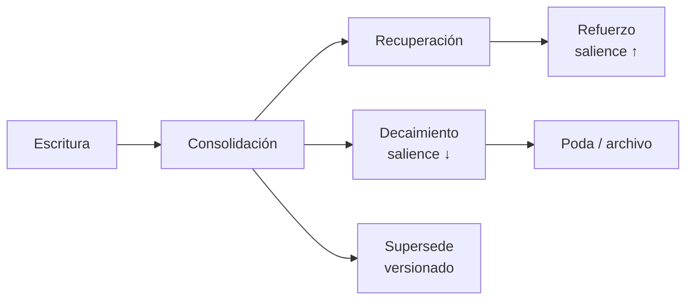

# 04 — Modelo de memoria y aprendizaje continuo

**Estado:** 🔵 En revisión · **Última actualización:** 2026-08-16 · **Habilita:** Fase 3

## 1. Principio

Los documentos son lo que el usuario escribió; la **memoria** es lo que el sistema sabe. La memoria persiste entre sesiones, se consolida con el tiempo y decae cuando pierde vigencia — igual que la humana, pero auditable.

### 1.1 Alcance de v0.4 vs Fase 4/5 (agregado en revisión, 2026-07-31)

Este documento nombra un "Learning Agent" y un "Memory Agent" en varios lados — son los nombres
de dominio de doc 03 (Arquitectura de agentes), que es **Fase 4** y todavía no tiene código
(sigue 🟡 Borrador). v0.4 (esta fase, Fase 3) empieza antes que Fase 4, así que no puede depender
de agentes reales que no existen. Se resuelve con el mismo mecanismo que ya usa `/v1/query` desde
Sprint 4 (doc 06 §3: *"Estos contratos se usan desde la Fase 1 (aunque el 'planner' sea un
pipeline fijo), para que la extracción a agentes reales en Fase 4 sea un refactor y no una
reescritura"*):

- **v0.4 implementa "Learning"/"Memory" como tasks de Celery encadenadas directamente** (mismo
  patrón que `kos.ingest_document` → `kos.embed_document` → `kos.enrich_document` →
  `kos.graph_sync` → `kos.graph_retire_document`), no como agentes orquestados por un planner.
  Donde este doc dice "el Learning Agent destila..." o "el Memory Agent busca...", leer "la task
  `kos.memory_learn`/`kos.memory_recall` hace...".
- **En v0.5 (Fase 4)** estos mismos pasos se exponen como agentes reales sobre el mismo contrato
  (`MemoryItem`, herramientas MCP `memory.recall`/`memory.store` ya listadas en doc 06 §4) — un
  refactor de orquestación, no una reescritura del modelo de datos ni de las reglas de este doc.

  > **Planificado — Sprint 21** (doc 08, decidido 2026-08-16): `kos.memory_learn` sigue siendo la
  > task de Celery que dispara la escritura (no bloquea `/v1/query`, sigue siendo asíncrona), pero
  > pasa a construir un `LearningAgent` real y llamarlo vía un servidor MCP embebido en el worker
  > en vez de llamar `learn_from_query_answer` directo — el "refactor de orquestación" que este
  > párrafo prometía, sin tocar el modelo de datos. `MemoryAgent.recall` (Sprint 17, standalone)
  > se conecta por primera vez al Planner: la "Recuperación" del §3 deja de ser solo un paso del
  > diagrama sin dueño real.

## 2. Los cinco tipos de memoria

| Tipo | Contenido | Ejemplo | Escrita por |
|---|---|---|---|
| **Episódica** | Conversaciones e interacciones, con contexto | "El 3 de mayo pediste un roadmap de Kubernetes y descartaste Helm por ahora" | Learning Agent, tras cada sesión |
| **Semántica** | Conceptos consolidados, hechos destilados de múltiples fuentes | "El usuario despliega siempre en Railway" | Consolidación periódica |
| **Procedimental** | Cómo hacer cosas: procedimientos que funcionaron | "Para publicar el blog: build → rsync → purge CDN" | Learning Agent al detectar procedimientos |
| **Temporal** | Lo último que ocurrió; ventana deslizante | "Ayer se ingirieron 12 notas nuevas sobre LangGraph" | Pipeline de ingesta |
| **Preferencias** | Cómo trabaja el usuario | "Prefiere respuestas con código antes que teoría" | Learning Agent + declaraciones explícitas |

### Modelo de datos común

```
MemoryItem
├── memory_id
├── type              # episodic | semantic | procedural | temporal | preference
├── content           # texto destilado (no transcripciones completas)
├── embedding         # recuperación semántica de memorias
├── entities[]        # node_ids del grafo que menciona (enlace memoria ↔ grafo)
├── sources[]         # {doc_id, confidence} — ver §5 sobre confidence por fuente
├── confidence        # 0–1
├── salience          # importancia; decae con el tiempo, sube con cada uso
├── created_at / last_accessed_at
└── superseded_by     # versionado: una memoria nueva puede reemplazar otra
```

Almacenamiento: PostgreSQL (+pgvector para el embedding). Las memorias referencian nodos del grafo, nunca los duplican.

**Enlace a entidades (`entities[]`), decidido 2026-08-13:** `kos.memory_learn` escribía
`entities=[]` a secas (deuda de §1.1) porque vincular memoria al grafo con una extracción LLM
nueva sobre el contenido destilado costaría una llamada extra por cada `POST /v1/query` — en el
camino síncrono, justo donde el usuario espera. En vez de eso, `entities[]` se resuelve buscando
qué nodos del grafo ya comparten alguna de las `sources[]` de la memoria (la relación `MENTIONS`
que `graph_sync` ya construyó) — sin extracción nueva, casi gratis. Si una memoria no comparte
ninguna fuente con el grafo (ej. inferida solo de la conversación, sin evidencia documental),
`entities[]` queda vacío; es aceptable y no bloquea el resto del modelo.

## 3. Ciclo de vida



1. **Escritura** — la task `kos.memory_learn` (§1.1) destila cada interacción: qué se preguntó, qué se decidió, qué funcionó. Nunca se guardan transcripciones crudas como memoria.
2. **Consolidación** — job periódico vía Celery beat, `kos.memory_consolidate`, cada `KOS_MEMORY_CONSOLIDATION_HOURS` (default 24h; mismo patrón que `KOS_SYNC_POLL_SECONDS`, doc 05 §2). Agrupa memorias episódicas repetidas en semánticas ("3 veces preguntó por X" → "le interesa X"), detecta duplicados y contradicciones.
3. **Recuperación** — la task/endpoint de recuperación busca por similitud + entidades del grafo + recencia, ponderado por `salience` y `confidence`.
4. **Decaimiento y poda** — `salience` decae exponencialmente: `salience(t) = salience_0 · 0.5^(t / half_life)`, con `half_life` configurable por tipo vía `KOS_MEMORY_SALIENCE_HALF_LIFE_DAYS` (default 30 días; episódica/semántica/procedimental/preferencias decaen así). La memoria **temporal** no decae por fórmula: expira directo al salir de su ventana deslizante (ya es effímera por diseño, §2). Nada se borra sin pasar por estado archivado.
5. **Versionado** — una memoria que contradice otra más antigua la marca `superseded_by`; la historia queda auditable.

## 4. Aprendizaje continuo (dominio 8)

El aprendizaje es el pipeline que mantiene todo el sistema consistente ante cada cambio. **v0.4
(Fase 3) construye los primeros tres pasos** — ya tienen dueño concreto (ingesta/grafo existentes
+ la memoria nueva de este doc). Los últimos dos son **Fase 5 (Recomendador, doc 07)**: dependen
de que exista el propio Recomendador, así que quedan fuera de v0.4 aunque el diagrama los muestre
para no perder la foto completa del dominio 8.

```
Evento (nueva nota / nota modificada / conversación terminada)
  ↓
Actualizar embeddings       (re-chunk + re-embed solo lo cambiado)                  [v0.2, ya existe]
  ↓
Actualizar grafo            (nuevas entidades/relaciones; confianza ±)              [v0.3, ya existe]
  ↓
Actualizar memoria          (temporal siempre; episódica si hubo interacción)       [v0.4 — este doc]
  ↓
Actualizar roadmap          (si cambió el mapa de skills)                           [Fase 5, fuera de v0.4]
  ↓
Actualizar conocimiento     (recalcular lagunas, contradicciones, sugerencias)      [Fase 5, fuera de v0.4]
```

> Estos dos últimos pasos se formalizan en [11 — Recomendador e inteligencia proactiva](11-recomendador-e-inteligencia-proactiva.md) (planificado 2026-08-16, v1.0).

Propiedades del pipeline:

- **Incremental**: solo se reprocesa lo afectado (ver [05 — Ingesta](05-ingesta-y-actualizacion.md), detección de cambios por hash).
- **Asíncrono**: corre en workers Celery; la UI nunca espera al aprendizaje.
- **Idempotente**: reprocesar el mismo evento dos veces no duplica nada.
- **Trazable**: cada actualización registra qué evento la causó.

## 5. Sistema de confianza

La confianza es transversal (documentos, grafo, memoria) y sigue reglas únicas:

| Evento | Efecto |
|---|---|
| Nueva evidencia independiente | `confidence ↑` (saturando hacia 1.0) |
| Contradicción detectada | `confidence ↓` en ambas afirmaciones + relación `CONTRADICTS` |
| Corrección del usuario | `confidence = 1.0`, inmutable para el pipeline |
| Fuente eliminada | recálculo con la evidencia restante |
| Antigüedad sin refuerzo | decaimiento lento (configurable por tipo) |

> **Nota de alcance (revisión 2026-08-13):** "Fuente eliminada → recálculo con la evidencia
> restante" ya tiene fórmula concreta, decidida para grafo y memoria por igual:
>
> ```
> confidence_nueva = min(1.0, max(confidence_base_i para i en fuentes_restantes) + ALIAS_BOOST × (n_restantes − 1))
> ```
>
> Es la misma regla que `_boosted_confidence` (Sprint 6, `graph_sync.py:104-106`) ya usa para
> sumar una fuente nueva — aplicada "hacia atrás" con las fuentes que sobreviven en vez de "hacia
> adelante" con la que se agrega. `ALIAS_BOOST = 0.05` (constante existente, `s9_confidence.py`).
> Con `n_restantes = 0` el nodo/memoria ya no sobrevive (se borra, ver `retire_document` y §3).
>
> Esto exige conocer el `confidence` de cada fuente individual, no solo el agregado — hoy
> `sources[]` es una lista plana de `doc_id` en ambos stores. Esquema resultante:
> - **Neo4j** (nodos y relaciones, doc 02 §3.1/§3.2): las propiedades no admiten listas de
>   objetos, así que se agrega un array paralelo `source_confidences[]` al mismo índice que
>   `sources[]`.
> - **Postgres/memoria** (`MemoryItem.sources`, JSONB): pasa de `list[str]` a
>   `list[{doc_id, confidence}]` directamente — no necesita array paralelo.
>
> **Umbral de poda tras recálculo:** si `confidence_nueva < 0.3`, el nodo/memoria se marca de
> inmediato como candidato a poda/revisión, en vez de esperar al ciclo normal de decaimiento de
> `salience` (§3.4). Es un umbral de alerta temprana — distinto del umbral de auto-poda por
> decaimiento (`<0.2`, doc 02 §4 regla 4): uno dispara revisión, el otro poda directamente.
>
> **Implementado en Sprint 14** (2026-08-15): `retire_document` (grafo,
> `packages/core/src/kos_core/storage/neo4j.py`) y la nueva `retire_memory_sources`/
> `kos.memory_retire_document` (memoria — Sprint 12 nunca conectó esta propagación, no era solo
> la fórmula lo que faltaba). `ALIAS_BOOST`/`PRUNE_THRESHOLD` viven en `kos_core.confidence`
> (antes `ALIAS_BOOST` estaba mal ubicado en `apps/workers/pipeline/s9_confidence.py`, que ahora
> lo reexporta). Verificado en vivo contra infra real, ver `docs/sprints/sprint-14.md`.

## 6. Detección de duplicados y reorganización

- **Duplicados**: candidatos por similitud de embeddings (>0.92) confirmados por LLM; se propone fusión, el usuario decide (en Fase 3; autonomía configurable en Fase 5). Umbral fijo en código (constante, no variable de entorno) — mismo criterio que `SIMILARITY_THRESHOLD` en entity resolution del grafo (Sprint 6, `apps/workers/src/kos_workers/tasks/graph_sync.py`): son parámetros de un algoritmo, no configuración de despliegue.
- **Reorganización de notas**: el sistema propone mover/renombrar/etiquetar notas de Obsidian según clusters del grafo. Siempre como propuesta aplicable vía herramienta MCP — nunca toca el vault sin aprobación.

## 7. Meta de la Fase 3

> El sistema evoluciona sin intervención manual: cualquier cambio en las fuentes se refleja en embeddings, grafo y memoria en menos de 5 minutos, y el usuario puede auditar qué cambió y por qué.
