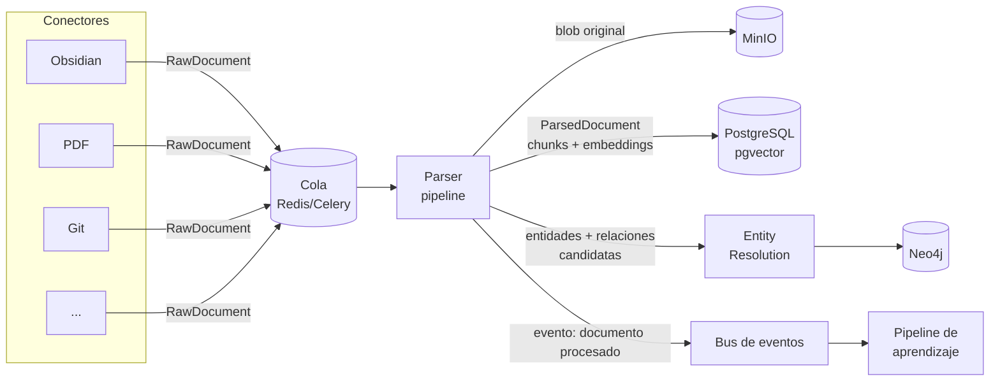

# 05 — Flujo de ingestión y actualización del conocimiento

**Estado:** 🟢 Aprobado (2026-07-13) · **Última actualización:** 2026-07-11 · **Habilita:** Fase 1

## 1. Vista de conjunto



## 2. Contrato de conector

Todo conector implementa la misma interfaz; el núcleo no conoce ninguna fuente ([ADR-0001](adr/0001-nucleo-independiente-de-fuentes.md)):

```python
class Connector(Protocol):
    name: str                                   # "obsidian", "pdf", "git"…

    def discover(self) -> Iterator[SourceRef]:  # enumera documentos disponibles
    def fetch(self, ref: SourceRef) -> RawDocument
    def watch(self) -> Iterator[ChangeEvent]:   # cambios en tiempo real (opcional)
```

- `SourceRef` identifica un documento en su fuente (ruta, URL, id) + un `content_hash`.
- `watch()` es opcional: las fuentes sin notificaciones se cubren con polling programado.
- Un conector **no** parsea, no hace chunking, no toca bases de datos.

### Conectores de la Fase 1

| Conector | Particularidades |
|---|---|
| **Obsidian** | Markdown + frontmatter YAML → metadata; wikilinks `[[...]]` → `links[]` (futuras aristas `MENTIONS`); tags → keywords; watcher de filesystem para `watch()` |
| **PDF** | Extracción de texto + estructura (títulos, páginas); blob original a MinIO; OCR fuera de alcance hasta Fase 3 |
| **Git** | README y docs del repo + metadata de commits; el código fuente como documento es Fase 2+ |

## 3. Pipeline del parser

Etapas componibles y testeables por separado; cada una enriquece el `ParsedDocument`:

| # | Etapa | Salida | Cómo |
|---|---|---|---|
| 1 | Normalización | texto limpio + estructura | por tipo MIME |
| 2 | Metadata | título, autor, fechas, idioma | frontmatter/heurísticas |
| 3 | Chunking | `chunks[]` | configurable: por encabezados (default), tamaño fijo, semántico |
| 4 | Embeddings | vector por chunk | bge-m3 vía Ollama, en lotes |
| 5 | Resumen | `summary` | LLM local |
| 6 | Keywords y enlaces | `keywords[]`, `links[]` | extracción + los del conector |
| 7 | Entidades | `entities[]` candidatas | LLM con salida estructurada validada contra la ontología |
| 8 | Relaciones | `relations[]` candidatas | LLM, solo entre entidades detectadas |
| 9 | Confianza | `confidence` por ítem y global | reglas + auto-evaluación |

Las etapas 5–8 usan LLM y son las caras: se ejecutan en workers, en lotes, y son **opcionales por configuración** (Fase 1 puede correr solo 1–6; la 7–8 llegan con la Fase 2).

## 4. Entity Resolution (antes de escribir al grafo)

1. Normalizar el nombre candidato (`FastAPI` → `fastapi`).
2. Buscar nodos existentes: match exacto por `canonical_name`+tipo → merge directo.
3. Sin match exacto: similitud de embeddings de nombres/alias; >0.9 → candidato a merge, decide LLM.
4. Merge: suma evidencia y sube `confidence`. Nuevo: crea nodo con la evidencia inicial.
5. Nunca sobreescribir datos con `extracted_by: "user"`.

## 5. Actualización incremental

La ingesta es **idempotente y basada en hashes**:

```
ChangeEvent (created | modified | deleted)
  ↓
content_hash igual al registrado → ignorar
  ↓ distinto
re-parsear documento → diff de chunks (solo re-embed los cambiados)
  ↓
diff de entidades/relaciones:
  nuevas → entity resolution → grafo
  desaparecidas → decae la evidencia (no se borra el nodo si tiene más fuentes)
  ↓
evento "documento actualizado" → pipeline de aprendizaje (doc 04)
```

- **deleted**: el documento se marca tombstone (el blob se conserva en MinIO); su evidencia se retira del grafo y la confianza de los nodos afectados se recalcula.
- Reprocesar un vault completo desde cero debe ser siempre posible (`kos reindex`): los almacenes derivados (pgvector, Neo4j) se reconstruyen desde MinIO + fuentes.

## 6. Garantías

| Garantía | Mecanismo |
|---|---|
| Ningún dato original se pierde | blobs inmutables en MinIO |
| Reprocesable | derivados reconstruibles desde los originales |
| Idempotente | claves por `doc_id` + `content_hash` |
| No bloquea al usuario | todo en workers Celery |
| Trazable | cada documento registra pipeline_version y timestamps por etapa |
| Latencia objetivo | cambio en fuente → sistema actualizado en <5 min (Fase 3) |

## 7. Meta de la Fase 1

> Ingerir el vault de Obsidian completo (~1.000 notas), PDFs y un repo Git; y responder preguntas con citas correctas provenientes de esas fuentes mediante búsqueda híbrida (texto + embeddings).
